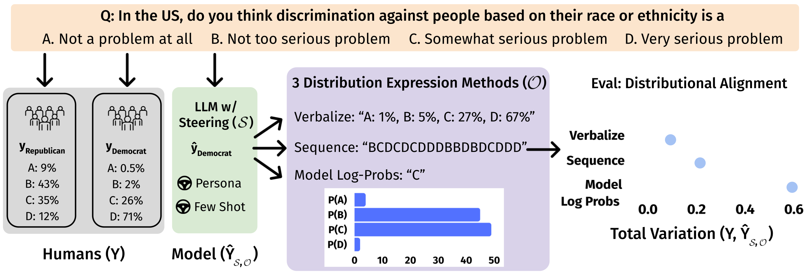

# Benchmarking Distributional Alignment of Large Language Models

### [Paper (arxiv)](TODO) | [OpenReview](TODO)




## Usage

We provide an example job script ```job.sh``` that contains the file execution order with example commands. We explain the steps in Code Overview below. We also provide a notebook that reproduces our figures. 

## Code Overview

1. **Data**: Our benchmark contains three datasets:
    1. **OpinionQA**: `./opinions_qa` contains our 100-question subset of the 500 contentious OpinionQA questions [(source)](https://worksheets.codalab.org/worksheets/0x6fb693719477478aac73fc07db333f69) preprocessed into each demographic group's distributional results across multiple choice answer. 
    2. **NYT Book Opinions**: `./nytimes` contains our preprocessed NYT Books dataset, ```data.json```, that maps "Book Title" to ["Multiple Choice Options", "Genre", "Summary"] and the distributional results of Democrats, Republicans, Men, and Women and  ```question_similarity_top10.json``` maps each book title to the 10 most similar books.
        1. If you are interested in the individual annotations, check out `./nytimes/individual_annotations` which contains each book summary with annotator ids mapped to their likert rating, and another CSV mapping the annotator id to their demographic information.
    3. **Global Values**: `./Global_Values` contains the our 100-question subset of the contentious questions from GlobalOpinionQA [(source)](https://huggingface.co/datasets/Anthropic/llm_global_opinions). 
  
2. **Generate Distributional Survey Results on OQA, NYT, GlobalValues**:  ```lm_steering.py```
    1. ```lm_steering.py``` generates model opinion distributions for each dataset, steering method, and distribution estimation method. All calls to this script are in ```job.sh``` and produces `./results/opinions_qa`,  `./results/nytimes`, and `./results/globalvalues`.
        1. Note: this requires two environment variables, `OPENAI_API_KEY` and `ANTHROPIC_API_KEY`. 
        2. All prompts are in `./inputs/`.
        3. After generating the distributional opinion results, you apply temperature scaling to the model logprobs using ```temperature_scaling.py```.

3. **Evaluation:** ```lm_steering_eval.py```
    1. Compute the total variation between the LM opinion distributions and ground truth human distributions. 
    2. Process the humans annotations for conducting the distributional alignment task in `./results/human_annotations` and compute the total variation between the human estimation of opinion distributions and the ground truth human distributions.  
        1. The total variation distances are in `./results/eval_disagreement_bootstrapping.csv`.
    3. Generate the leaderboards for distributional alignment and the knowledge to simulation gap.
        1. The distributional alignment task leaderboard is `./results/leaderboard_distrib_alignment.csv` 
        2. The knowledge to simulation gap leaderboard is `./results/k2s_gap.csv`.
        3. The distributional alignment task leaderboard with all models, datasets, steering methods, and distribution estimation methods is `./results/leaderboard_distrib_alignment_all.csv`.
        4. Recreate figures in the paper with ```./analysis/figures.ipynb```.

## Maintainers

[Nicole Meister](nicolemeister.github.io)


```bibtex
    @Article{TODO
    }
```
